# Не приходя в сознание — Рефакторинг в 2026

История смерти и перерождения микросервиса в суровую эпоху LLM...

---

<link rel="stylesheet" href="https://cdnjs.cloudflare.com/ajax/libs/font-awesome/6.5.2/css/all.min.css">
<pre class="mermaid">
  sequenceDiagram
    participant User as 👤 Пользователь
    participant Monolith as 🐘 Барахолка (PHP)
    participant Uploader as ☕ Pdf Uploader (Java)
    participant ImageStore as 🗃️ ImageStore (Java)
    User->>+Monolith: 1. Отправляет PDF в диалог
    Note right of User: Барахолка не умеет отображать PDF в диалоге
    Monolith->>+Uploader: 2. Передает PDF на обработку
    Note over Uploader: Конвертация PDF → JPEG
    Uploader->>+ImageStore: 3. Отправляет страницы в JPEG
    ImageStore-->>-Uploader: 4. Возвращает идентификаторы сохраненных картинок
    Uploader-->>-Monolith: 5. Отдаёт идентификаторы барахолке
    Monolith-->>-User: 6. Показывает картинки вместо PDF в диалоге
</pre>
<script src="https://cdn.jsdelivr.net/npm/mermaid@11/dist/mermaid.min.js"></script>
<script>
  mermaid.initialize({ startOnLoad: true, securityLevel: 'loose' });
</script>

* Начинается история с архитектуры обработки фактур на Фарпосте тянущейся со стародавних времён

---

# Главный герой — pdf-uploader

* Конвертирует pdf в jpeg
* Микросервис работал с 2017ого года 8 лет, практически без изменений, почти не требуя поддержки.
* Однако мир подвержен трансгрессии, которая постоянно ускоряется, не оставляя ничего долговременного и стабильного...

---

# Неожиданный поворот 13ого марта

* Началось все с обращения пользователя в техподдержку Фарпоста
* 
* Силами техподдержки проблема оказалась нерешаема
* 

---

# Это привело к появлению задачи в Jira

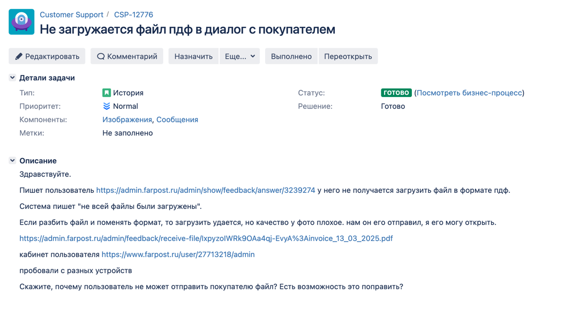

* 21 марта появилась первая задача для клиентского отдела

---

# ...и еще одной задачи

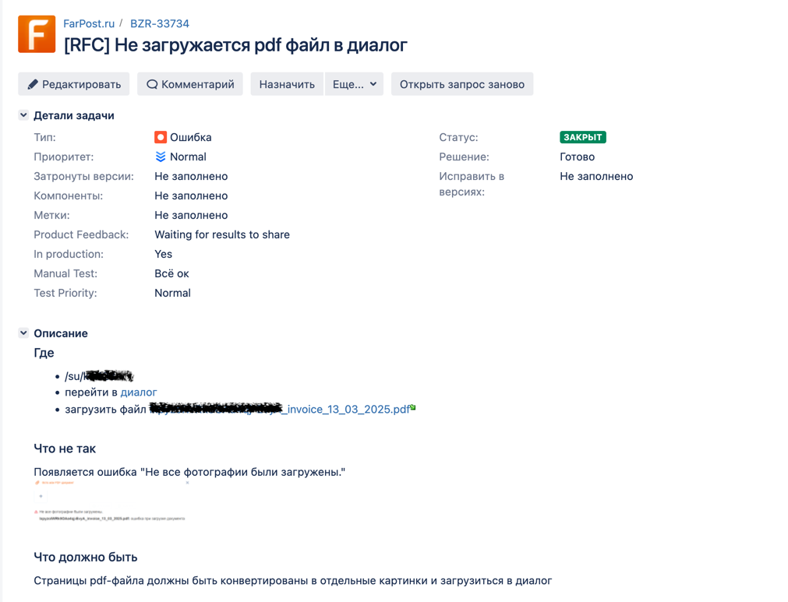

* Через все тернии, за каких то 8 дней проблема добралась до программистов!

---

# Первое обсуждение

* 25 марта мы раскурились до начала обсуждения 
* 26ого вспомнили про меня
  
  

---

# Состав преступления не обнаружен

* Поэтому 27 марта появилась идея как закрыть задачу ничего не делая
  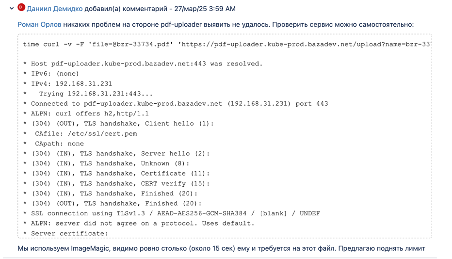
* Ведь как известно, лучший код тот — который не был написан
* Всё по канонам даосизма
* Дело закрыто!

---

# ...однако дело закрыть не удалось

* Предложение похоронить задачу столкнулось (со вполне справедливым) скепсисом
  
* Барахолке таймаут в 15 секунд не подоходит
* И похоже нужно залезть в k8s-под, чтобы узнать реально на что реально затрачивается время, без сетевых задержек

---

<div id="player1"></div>
<link rel="stylesheet" type="text/css" href="https://cdn.jsdelivr.net/npm/asciinema-player@3/dist/bundle/asciinema-player.css"/>
<script src="https://cdn.jsdelivr.net/npm/asciinema-player@3/dist/bundle/asciinema-player.min.js"></script>
<script>
    AsciinemaPlayer.create(
      '/src/check-old-speed.cast',
      document.getElementById('player1'),
      {
         loop: false,
         preload: "auto",
         rows: 30,
         cols: 130,
         theme: "solarized-light"
      }
    );
</script>

---

# Расследование продолжается

Между делом лезем глянуть оригинальный репозиторий
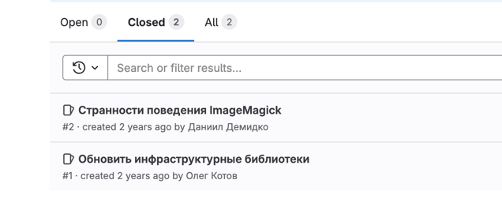

---

# Расследование продолжается

Видим какие-то старые, на первый взгляд не критичные проблемы
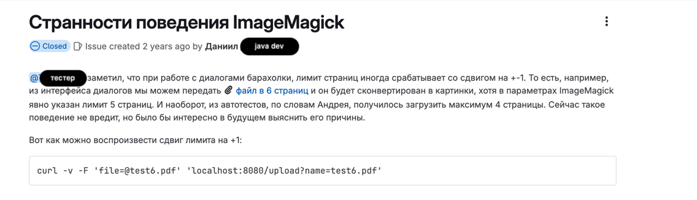

---

# Расследование продолжается

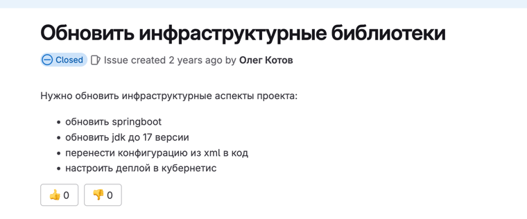

* Похоже, код морально и технически устарел
* Требует плановой поддержки
* Возьмем это на заметку в голове

---

<div id="player2"></div>
<link rel="stylesheet" type="text/css" href="https://cdn.jsdelivr.net/npm/asciinema-player@3/dist/bundle/asciinema-player.css"/>
<script src="https://cdn.jsdelivr.net/npm/asciinema-player@3/dist/bundle/asciinema-player.min.js"></script>
<script>
    AsciinemaPlayer.create(
      '/src/old-code.cast',
      document.getElementById('player2'),
      {
         loop: false,
         preload: "auto",
         rows: 30,
         cols: 130,
         theme: "solarized-light"
      }
    );
</script>

---

<style>
section {
  font-size: 1.5em;
}
</style>

# Что мы выяснили

* Сервис сохраняет файл на диск, утилита читает, и пишет файл, сервис снова читает результат...
* Это совершенно бесполезная промежуточная работа с диском, без которой можно было бы обойтись
* По результатам дебага прямо на проде, оказалось что на это в среднем уходит 1-2с, плохо, но не бутылочное горлышко
  ```shell
  2025-04-01 19:32:39 [http-nio-8080-exec-3] I c.f.p.c.render.ImageMagicRenderer - Temp file /tmp/pdf_renderer8851508053510807606/input.pdf created at 1.459 ms
  2025-04-01 19:32:50 [http-nio-8080-exec-3] I c.f.p.controller.render.ConvertCmd - Convert /tmp/pdf_renderer8851508053510807606/input.pdf completed at 10.47 s
  ```
* Бутылочное горлышко (9 секунд для проблемного файла) это конвертация внешней утилитой
* Но уже можно сделать вывод, что Java не дает никаких преимуществ в этом кейсе, а служит оберткой
* За все на самом деле отвечает `ImageMagic`, и дальше имеет смысл копать именно в его сторону

---

<div id="player3"></div>
<link rel="stylesheet" type="text/css" href="https://cdn.jsdelivr.net/npm/asciinema-player@3/dist/bundle/asciinema-player.css"/>
<script src="https://cdn.jsdelivr.net/npm/asciinema-player@3/dist/bundle/asciinema-player.min.js"></script>
<script>
    AsciinemaPlayer.create(
      '/src/gs-detected.cast',
      document.getElementById('player3'),
      {
         loop: false,
         preload: "auto",
         rows: 30,
         cols: 130,
         theme: "solarized-light"
      }
    );
</script>

---

# Главный подозреваемый установлен

* Это движок рендеринга `GhostScript`
* Была целая капуста из слоев абстракции: `jvm` - `shell` - `imagemagick` - `ghost script`
* Воспользуемся силой google и поищем бенчамарки для этого движка
* Умные люди сделали их за нас
* https://connect.hyland.com/t5/alfresco-blog/pdf-rendering-engine-performance-and-fidelity-comparison/ba-p/125428

---

# Смотрим альтернативные движки

<style>
section {
  font-size: 1.5em;
}
</style>

* ```
  Ghostscript   Native	9.21
  MuPDF         Native	1.10a
  Xpdf          Native	3.04
  Pdfium        Native	2017-04-10
  Aspose        Java	17.2.0
  ICEPdf        Java	6.2.0
  Sejda         Java	3.0.13
  PDFBox        Java	2.0.5
  ```
* 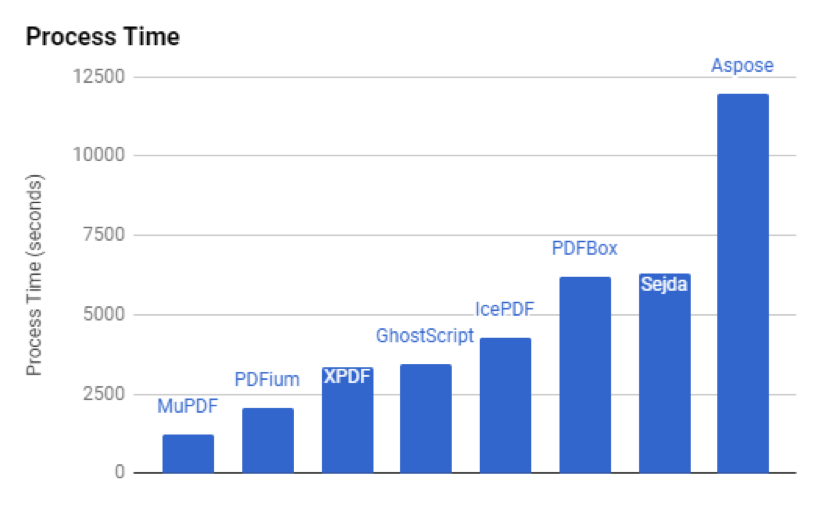

---

# Очевидный победитель конкурса альтернатив — pdfium

* Почти самый быстрый (вместе с mupdf в большом отрыве от других)
* Opensource
* Поддерживается командой Google

---

# Вердикт следствия


* излагаем выводы, но не торопимся с решением

---

<style>
section {
  font-size: 1em;
}
</style>

# С новыми данными обсуждение продолжается

* Получаем подтверждение серьезности проблемы
  
* Пул php воркеров надо спасать!
* Предлагаем новую идею
  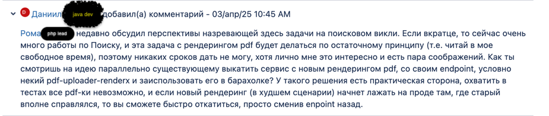
* Что если параллельно завести еще один сервис и часть трафика перекидывать на него?

---

# План оперативных действий согласован

* 
* 
* 
* 

---

# ...и еще одна задача в Jira

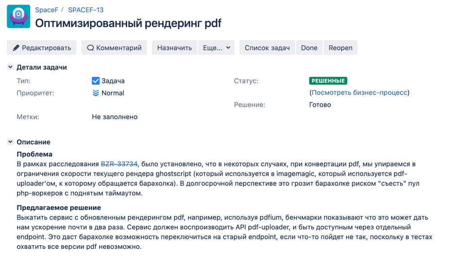

* На самом деле она нужна, чтобы начать с чистого листа
* Описать предпосылки и требования рефакторинга

---

# Думаем над рефакторингом

* Есть один нюанс...
  
* Pdfium, как и gs, нативная библиотека
* Но для нее нет готовой обвязки для jvm

---

# Как доказать существование прошлого?

* Можем ли мы доказать что прошедшее действительно происходило?
* Что если все наши воспоминания подложные?
* Что если секунду назад наше сознание не существовало, а через секунду прекратит существовать?
* На этой интересной ноте я и понял, кто сегодня займется рефакторингом...

---

# Рефакторинг

* Начнем с удаления неактуального кода
* ```shell
  rm -rf pdf-uploader
  ```
* На этом работа с Java кодом завершена
* Воспользуемся одной очень полезной утилитой
* ```shell
   cargo new pdf-uploader-rs
   ```
  
---

# Создаем себе repl-среду

```rust
fn diagnostic(path: &str) {
    info!("'{}' diagnostic...", path);
    let pdfium = Pdfium::default();
    let config = default_print_config();
    let path = Path::new(path);
    let filename = path.file_name().unwrap().to_str().unwrap();
    let pdf = read(filename).unwrap();
    let pages_limit = 10;
    let start_time = Instant::now();
  
    let images = convert_pdf_pages_to_images(&pdfium, &config, &pdf, pages_limit).unwrap();
  
    info!("'{}' converted at {:?}", filename, start_time.elapsed());
    for (i, jpeg) in images.iter().enumerate() {
        write(format!("{}.{}.jpg", filename, i), jpeg).unwrap();
    }
}
```

---

# Создаем себе repl-среду

```shell
# собираем образ
docker build --platform linux/amd64 -t pdf-uploader-diagnostic .

# передаем ему файл в репозитории, например qr.pdf
docker run --platform linux/amd64 -v `pwd`:`pwd` -w `pwd` -it --rm pdf-uploader-diagnostic qr.pdf
```

---

# Может показаться пугающе странным

* Это и есть вся работа которую потребовалось сделать руками для запуска новой версии сервиса

---

# Почему все таки Rust?

* Преимущества нативного кода очевидны, на этом задерживаться не будем.
* Но есть кое-что более важное в эпоху llm:
    * Rust благодаря очень хорошей строгой статической типизации имеет тенденцию разворачивать те ошибки, которые в
      другом языке были бы ошибками runtime, в compile time
    * Это создает для нас очень быструю repl-среду, где можно работать с llm в цикле copy-paste code, copy-paste error
    * В других языках нам пришлось бы не ограничиваясь компиляцией, прогонять много тестов (JS не к ночи будь помянут)
    * А в Rust применимо допущение, если скопилировалось, то с очень большой вероятностью работает

---

# И вообще, говоря цитатами печально известных людей

> Хочется движухи!

---

* 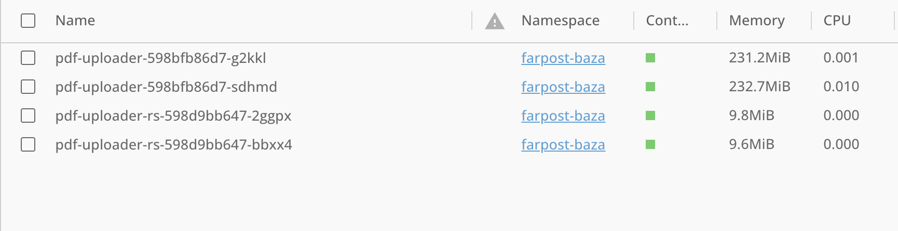
* ```log
   2025-04-11 19:22:06 [INFO] - [d3521b0c-4832-4bef-bf52-93e31d18e703] Converted PDF (875 KiB) to 3 images (215 KiB) in 108.138068ms
   2025-04-11 19:22:06 [INFO] - [d3521b0c-4832-4bef-bf52-93e31d18e703] Uploaded 3 images (215 KiB) to imagestore (1744363326869,1744363326925,1744363326953) in 123.376891ms
   ```

---

# Подводя итоги

* 
* 

---

# Подводя итоги

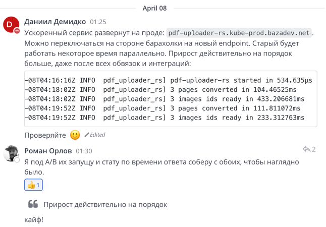

---

---

# Реакции ребят с барахолки 🙂

 

---

# Реакции ребят с барахолки 🙂

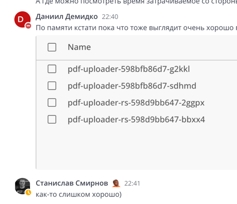 

---

# Реакции ребят с барахолки 🙂

 

* Так у нас и появился раздел RustServices
  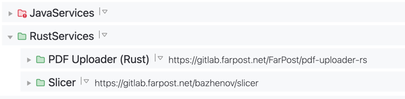

---

# Мораль истории проста

* Для бизнеса — программистов нужно будет меньше
* Для программистов — надо осваивать азы фермерства
* Для джунов...
    ```
      +------+
      |      |
      0      |
     /|\     |
     / \     |
             |
      ========
    ```

---

# Более оптимистично

* Программирование в тандеме с llm становится нормой,
  как раньше стали нормой ide.
* Теперь под рукой всегда есть тот, кому можно делегировать скучные задачи.
* Можно больше заниматься интересными вещами

---

# Вопросы, ответы и предложения

* Как вам этот способ рефакторинга?

---

# github.com/demidko

* Презентация лежит на GitHub
* Ставим звездочки
    * Ведь никогда нельзя забывать за что мы здесь все работаем
* Подписываемся